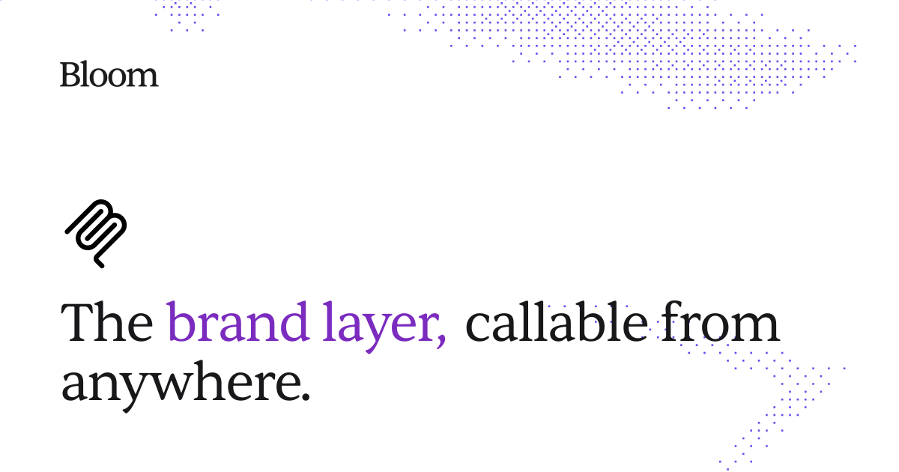

<div align="center">



<br />

# Bloom Agent Skill

**Teach your agent to create on-brand images with Bloom.**

[](https://skills.sh/trybloomai/bloom-skills)
&nbsp;
[](https://trybloom.ai/mcp)
&nbsp;
[](LICENSE)

<br />


</div>

---

Bloom already owns the brand: palette, typography, logo, aesthetic. This skill teaches your agent the rest: how to write prompts, pick aspect ratios, attach references, and write in-image headline copy.

## Quickstart

```bash
npx skills add trybloomai/bloom-skills --skill bloom --global
```

Then connect the Bloom MCP server in your agent:

```text
https://trybloom.ai/mcp
```

And ask:

```text
Generate an Instagram feed launch image for Acme with Bloom. The product box
floating above a messy breakfast table, morning light, one hand reaching into
frame. Photograph.
```

## Install

The same command works for every terminal agent. Find your client:

<table>
<tbody>
<tr>
<td>&nbsp; <b>Claude Code</b></td>
<td rowspan="5">

```bash
npx skills add trybloomai/bloom-skills --skill bloom --global
```

Drop <code>--global</code> to install in the current project only.

</td>
</tr>
<tr><td>&nbsp; <b>Codex</b></td></tr>
<tr><td>&nbsp; <b>Cursor</b></td></tr>
<tr><td>&nbsp; <b>Windsurf</b></td></tr>
<tr><td>&nbsp; <b>OpenCode</b></td></tr>
<tr>
<td>&nbsp; <b>Claude Desktop · Web · Cowork</b></td>
<td>Download the <a href="https://github.com/trybloomai/bloom-skills/releases/latest/download/bloom.skill.zip">ZIP</a> and upload it in Skills settings.</td>
</tr>
</tbody>
</table>

Full per-agent setup, updates, and troubleshooting live in [docs/quickstart.md](docs/quickstart.md).

> Bloom MCP must be connected separately. The skill guides the agent; the MCP does the work.

## What's inside

```text
skills/bloom/
  SKILL.md          dispatcher: loads first, points to the right rule
  rules/
    prompting.md    subject, composition, medium
    copy.md         in-image headline copy
    workflow.md     references, generation flow
    channels.md     aspect ratios per platform
```

<div align="center">
<br />
<sub>MIT · <a href="https://trybloom.ai/mcp">trybloom.ai/mcp</a></sub>
</div>
