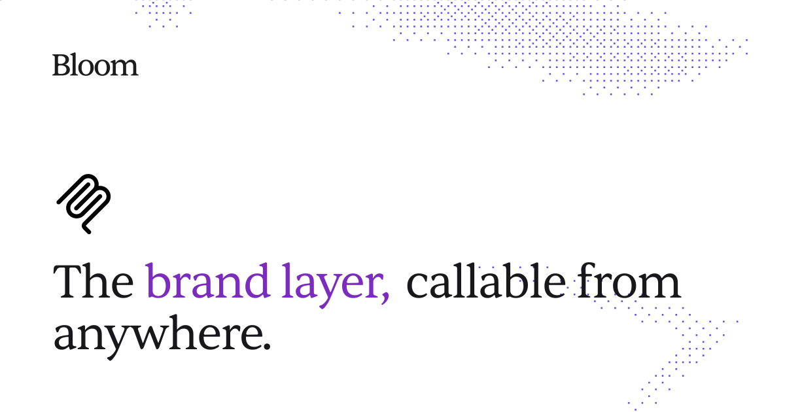

<div align="center">



# Bloom Skill and Agent Plugin

Persistent guidance and a portable MCP connection for agents working with Bloom.

</div>

Bloom is the brand layer: one place where a brand lives and evolves. It turns
websites, social media, brand guides, briefs, logos, and other brand material
into versioned Brand Skills that agents, applications, and people can use.

A Brand Skill can guide any capable system creating on the brand's behalf,
whether it is making images, slides, websites, video, documents, or something
else. Bloom can generate on-brand images, video, audio, and SVG; for other work,
Bloom supplies the brand context and the connected system creates the output.

The `bloom-skills` repository contains one optional Agent Skill that teaches an
agent what Bloom is, when to use it, and whether a workflow belongs on the API
or MCP. It also packages that same Skill with Bloom's remote MCP configuration
as an [Agent Plugins 1.0](https://agent-plugins.org/specification) plugin named
`bloom`.

> A Bloom Skill teaches an agent how and when to use Bloom.
>
> A Brand Skill contains the context for one particular brand.

The standalone Skill supplies guidance. The plugin also declares the MCP
connection; the client handles authentication. API and MCP remain the execution
paths.

## Install

Install in the current project so the guidance is reviewable and shared with
the repository:

```bash
npx skills add https://docs.trybloom.ai --skill bloom
```

Bloom's documentation hosts the same Skill as this repository. To install
directly from its source instead, run
`npx skills add trybloomai/bloom-skills --skill bloom`.

Use `--global` when you deliberately want Bloom guidance across unrelated
projects:

```bash
npx skills add https://docs.trybloom.ai --skill bloom --global
```

To use the Skill for one session without installing it:

```bash
npx skills use trybloomai/bloom-skills@bloom
```

### Upload to Claude

Download
[`bloom.skill.zip`](https://github.com/trybloomai/bloom-skills/releases/latest/download/bloom.skill.zip),
then in Claude choose **Customize → Skills → Create skill → Upload a skill**.

The ZIP contains the same `bloom/SKILL.md` as the repository install.

### Portable Agent Plugin

Use the repository root as the plugin directory, or download
[`bloom.plugin.zip`](dist/bloom.plugin.zip) and extract it into a directory.
Load that directory using a client that supports Agent Plugins 1.0 and the
`streamable-http` MCP transport. Follow that client's plugin installation and
OAuth sign-in flow.

The portable package contains:

```text
plugin.json                 # Identifier: bloom
mcp.json                    # Bloom MCP over Streamable HTTP
skills/bloom/SKILL.md        # Canonical Skill, unchanged
README.md
CHANGELOG.md
LICENSE
assets/bloom-mcp-og.png
```

Both JSON files declare the Agent Plugins `1.0.0` schemas. `mcp.json` defines
one server named `bloom` at `https://mcp.trybloom.ai/mcp`. OAuth discovery and
credential storage belong to the client; the package contains no credentials.
The ZIP has these files directly at its root, with no enclosing directory.

The manifest includes the optional
`extensions.com.openai.interface.websiteURL` presentation field so ChatGPT
shows Bloom's product website. OpenAI uses this listing field independently of
the portable `homepage` field. See
[OpenAI listing metadata](https://developers.openai.com/plugins/deploy/submission#listing-metadata).
Clients that do not use the OpenAI extension still discover the same Skill and
MCP configuration from their portable locations.

## Connect or integrate Bloom

- For interactive agent work, follow the
  [Bloom MCP quickstart](https://docs.trybloom.ai/mcp/getting-started).
- For an application or backend, follow the
  [Bloom API quickstart](https://docs.trybloom.ai/api).
- For the complete documentation map, read
  [Bloom's `llms.txt`](https://docs.trybloom.ai/llms.txt).

For a standalone Skill installation, configure MCP using the quickstart. A
plugin-capable client reads the connection from `mcp.json`. Interactive MCP
clients authenticate through Bloom's OAuth flow; server applications keep API
keys in their own secret store.

## Update or remove

```bash
npx skills update bloom
npx skills remove bloom
```

Add `--global` to update or remove a global installation.

## Package and validate

The canonical Skill remains `skills/bloom/SKILL.md`. Rebuild its existing upload
archive with:

```bash
scripts/package-skill.sh
```

That script verifies that `dist/bloom.skill.zip` contains the same `SKILL.md`.
Build the portable plugin archive with:

```bash
scripts/package-plugin.sh
```

Validate the checked-in plugin archive without rebuilding it:

```bash
scripts/validate-plugin.sh
```

Pass a ZIP path to `scripts/validate-plugin.sh` to check another local copy
against this checkout. These scripts run offline with Bash 3.2 or later,
POSIX `awk`, `zip`, Info-ZIP `unzip` (including `-Z`), and standard shell utilities.
No package manager or additional language runtime is required.

The Bloom-specific validator parses JSON and checks field types, duplicate and
unsupported fields, both exact `1.0.0` schema identifiers, matching plugin,
Skill-directory, Skill-frontmatter, and MCP-server names, and the remote
transport and endpoint. It requires `plugin.json`'s version to match the Skill's
`metadata.version` and the latest numbered changelog release. It also checks the
OpenAI website field and rejects other client-specific data. Changes under
**Unreleased** retain the current shared version until the next release.
Any release that changes shipped plugin contents updates all three versions
together.

Archive validation checks ZIP integrity, the exact file list, regular file
types, and every member byte-for-byte against its source. It also checks the
existing Skill ZIP's structure and canonical contents. The plugin builder
validates a temporary archive before replacing `dist/bloom.plugin.zip` and
preserves the Skill ZIP.

## License

[MIT](LICENSE)
